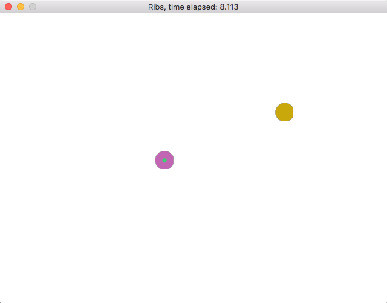

Ribs (or Ribs2D)
====

A 2D Ruby Interactive sand-Box Simulator. This is project is intended as the final project of W4167 Computer Animation.

Supported Interactions
----

+ **Left click**: select a particle, or unselect by hitting freespace
+ **Right click**: unselect a particle
+ **Space**: pause the simulation
+ **Backspace**: remove the selected particle
+ **D**: drag selected particle (and observe how the rest of the system runs!)
+ **S**: add a new spring force between the two selected particles
+ **G**: add a new simple gravity force in the scene by clicking freespace twice for the gravity vector
+ **P**: add a new particle by clicking freespace twice for the initial velocity
+ **Q**: quit Ribs
+ **F**: fix the selected particle (remove any forces applied to it), the velocity remains the same
+ **L**: lock the selected particle, same as fix, except that the velocity of the particle is set to 0 as well
+ AND MORE WILL BE ADDED!

Dependencies
----

+ Gosu
+ TexPlay

Screenshot
----

License
----

This project is licensed under LGPL.